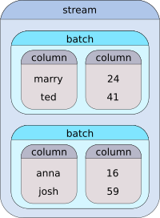

Introduction {#mainpage}
============

\tableofcontents

Preface
-------
---

__HiPipe__ is a C++ library for efficient data processing. Its main purpose is to simplify
and acclelerate data preparation for deep learning models, but it is generic enough to be used
in many other areas.

__HiPipe__ lets the programmer build intuitive data streams that transform,
combine and filter the data that pass through. Those streams are compiled,
batched, and asynchronous, therefore maximizing the utilization of the provided
hardware.

The complete source code can be downloaded from our official GitHub
[repository](https://github.com/iterait/hipipe).

**This project is under heavy development. The API is continuously changing without regard
to backward compatibility.**

Quick Start
-----------
---

Before proceeding, please install __HiPipe__ by following the
\ref installation "installation guide".

__HiPipe__ provides many smaller utilities, such as loading \ref CSV "CSV files" to
\ref Dataframe "dataframes", \ref Base64 "base64 decoders",
\ref Groups "data splitting" and [much more](modules.html). However, probably the most
useful funcionality of the library is \ref Stream "data stream processing".

Before we dive into details, we recommend to get familiar with the concept of C++
ranges and [Range-v3](http://ericniebler.github.io/range-v3/) library by Eric Niebler.
Ranges will soon become a fundamental part of C++ standard and Range-v3 library
is an experimental implementation of the proposal. To sum up the idea, a range can be
thought of as a pair of begin/end iterators with potentially infinite distance.

Now, a _stream_ in the context of __HiPipe__ is a range of _batches_, where each batch
contains one or more _columns_. To demonstrate this concept on an example,
let us assume that we have a table of four users and each user has
properties: `login` and `age`:

| login | age |
|-------|-----|
| marry | 24  |
| ted   | 41  |
| anna  | 16  |
| josh  | 59  |

A stream made of such data with batch size of two may look as following:



Of course, the stream may as well be loaded from a file or a database and may even
be infinite. __HiPipe__ provides \ref Stream "many tools" to manipulate such
streams using the pipe "|" operator. The following example demonstrates the main idea of
stream pipelining (see the full example in [example.cpp](example_8cpp_source.html)):

```{.cpp}
namespace hps = hipipe::stream;
using hps::from; using hps::to; using hps::by; using hps::dim;

HIPIPE_DEFINE_COLUMN(login, std::string)  // helper macro to define a column of strings
HIPIPE_DEFINE_COLUMN(age, int)

std::vector<std::string> logins = {"marry", "ted", "anna", "josh"};
std::vector<int>           ages = {     24,    41,     16,     59};

auto stream = ranges::view::zip(logins, ages)

  // create a batched stream out of the raw data
  | hps::create<login, age>(2)

  // make everyone older by one year
  | hps::transform(from<age>, to<age>, [](int a) { return a + 1; })

  // increase each letter in the logins by one (i.e., a->b, e->f ...)
  | hps::transform(from<login>, to<login>, [](char c) { return c + 1; }, dim<2>)

  // increase the ages by the length of the login
  | hps::transform(from<login, age>, to<age>, [](std::string l, int a) {
        return a + l.length();
    })

  // probabilistically rename 50% of the people to "buzz"
  | hps::transform(from<login>, to<login>, 0.5, [](std::string) -> std::string {
        return "buzz";
    })

  // drop the login column from the stream
  | hps::drop<login>

  // introduce the login column back to the stream
  | hps::transform(from<age>, to<login>, [](int a) {
        return "person_" + std::to_string(a) + "_years_old";
    })

  // filter only people older than 30 years
  | hps::filter(from<login, age>, by<age>, [](int a) { return a > 30; })

  // asynchronously buffer the stream during iteration
  | hps::buffer(2);

// extract the ages from the stream to std::vector
ages = hps::unpack(stream, from<age>);
assert((ages == std::vector<int>{45, 64}));
```

For more information, please refer to the [modules](modules.html) documentation section
and browse the API reference.

Multidimensional data
---------------------
---

In __HiPipe__, when we talk about multidimensional data, we are talking about nested
ranges. For instance, `std::vector<int>` is a one dimensional vector and
`std::vector<std::vector<int>>` is a two dimensional vector.

Most of the stream modifiers have a special parameter called `dim<N>`,
that denotes in which dimension should the modifier operate. For instance,
consider the transform() from our previous example:

```{.cpp}
HIPIPE_DEFINE_COLUMN(login, std::string)

...

  // This transformation is applied in dimension 1 (default), so in the case of the
  // login column, the transformation function expects std::string.
  | hps::transform(from<login>, to<login>, [](std::string l) { return l + "_abc"; })

  // This transformation is applied in dimension 2, which for std::string means
  // that it is applied on each letter.
  | hps::transform(from<login>, to<login>, dim<2>, [](char c) { return c + 1; })

  // And this transformation is applied in dimension 0, which denotes that the function
  // expects the whole batch.
  | hps::transform(from<login>, to<login>, dim<0>, [](std::vector<std::string> login_batch) {
        login_batch.push_back("new_login");  // this inserts a new login to the current batch
        return login_batch;
    })
```

In __HiPipe__, there are no constraints on the shape of the columns. Batch
sizes can differ batch to batch, as well as the sizes of the data across a
single dimension. For instance, it is possible to have a batch of variably long
sequences (e.g., a batch of video frames from videos of different length) and
stream modifiers, such as transform() and filter(), will handle it in any dimension
you choose. To define a column containing multidimensional data, the most simple
solution is to wrap the data in `std::vector` (but any reasonable container will
suffice):

```
HIPIPE_DEFINE_COLUMN(stock_price_evolution, std::vector<double>)
```

Python
------
---

__HiPipe__ provides a convenient functions to convert and stream data to Python.
This part of the documentation is yet to be prepared.
Meanwhile, please refer to the \ref Python "Python binding API" documentation.
